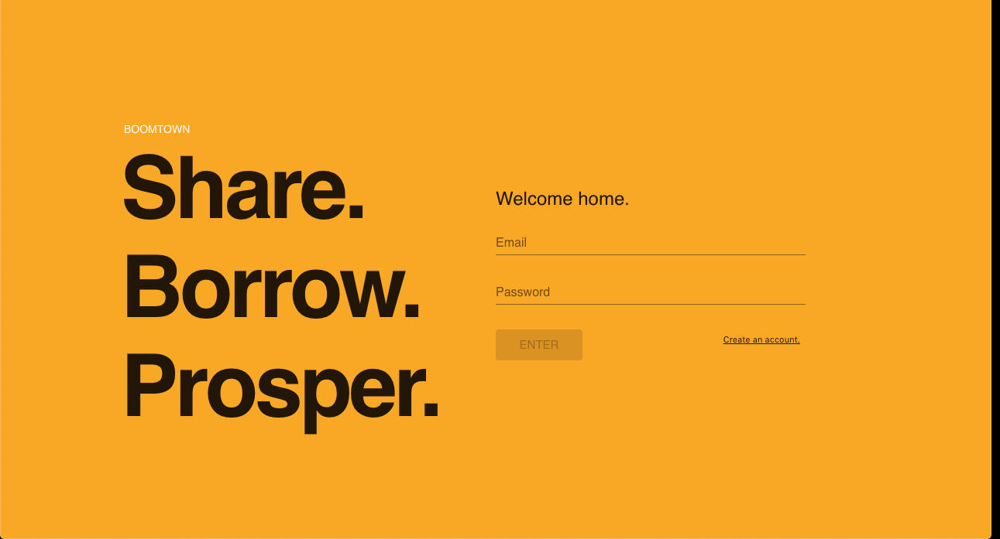
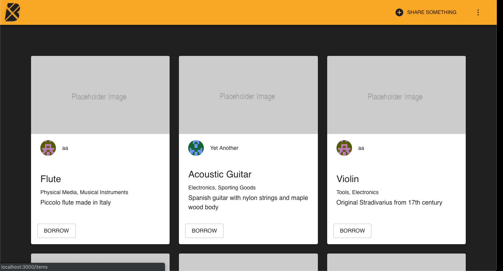

# Boomtown 🏙

This is a full stack project at RED Academy App Developer Program. It is a website for sharing goods, lending and borrowing them. On the back-end, it uses Postgres as the database server, Node.js with Express for web services and Apollo for GraphQL queries. On the front-end, it leverages React as the rendering tool, together with Redux for state management and Appolo for GraphQL queries. For the interface elements we use Material UI.

## Screenshots





## About the Author

### Andre Marques Moura

I am an experienced Product Manager working in the Tech Industry. I participated in the initiation and launch of 4 startups. I am currently sharpening my skills by learning about the latest Web Technologies at RED Academy - Vancouver. You can connect with me on LinkedIn [here](https://www.linkedin.com/in/andre-marques-moura).

## Main Takeaways

In this project, I learned modern techonologies for integrating the back-end. Here are some of the main takeaways:

- Although not a new technology, SQL is a solid, tried and true way to create, read, update and delete (CRUD) data.
- Node.js brings the flexibility of Javascript to the server side. In conjunction with libraries like Express, it is very easy to instantiate a web server.
- RESTful APIs are a straightforward method to add and retrieve data from an HTTP server. However, they present limitations when the complexity of the data or the queries is high.
- To deal with more complex database interactions, GraphQL is a powerful tool. One can use a library like Apollo to integrate GraphQL into a web server as a middleware.
- React uses functional programing to dynamically create pages where state is used to control behaviour and manipulate data. The flexibility its component-based programming gives you opens a new dimension in Web Programming.
- Redux allows you to centralize the storage of states for all React components, becoming the single source of truth.
- Appolo works on the client side enabling GraphQL queries.
- Material UI makes Web and App development much more productive by provinding you with a library of components to be used to create common interface elements.
- JSX (XHTML in JavaScript) and JSS (CSS in JavaScript) gives ypu the opportunity to use XHTML and CSS in a much more programmatic way.

## Technologies Used

- React JS
- Redux
- Apollo
- GraphQL
- PostgreSQL
- Express
- NodeJS

## Instructions for running the server

You will need a SQL database for this project and connect it to Apollo. Commands must be run from the `server` directory:

### Installation

```bash
npm install
```

### Run

```bash
npm run start:dev
```

## Instructions for running the Client

Commands must be run from the `client` directory:

### Installation

```bash
npm install
```

### Run

```bash
npm start
```

### Build

```bash
npm run build
```
